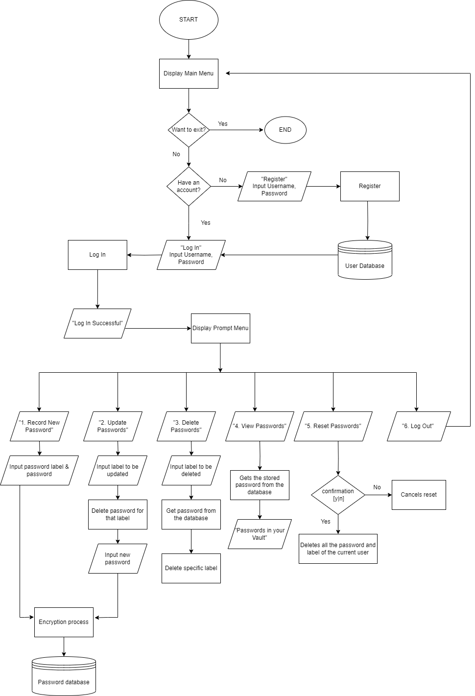

<p align = "center">
   
</p>

# CipherKey

<br> 
&nbsp;&nbsp;&nbsp;CipherKey is a secure and convenient solution designed to help users effectively manage their passwords. With the growing number of online accounts and the need for strong passwords, our app offers a reliable way to securely store and organize passwords. By prioritizing user convenience and robust security measures, we aim to simplify password management while minimizing the risk of security breaches.  
<br><br>

## 📐Setup 
<br>

  1. ###### Clone the repository and unzip all the files.
  2. ###### Run main .exe 

&nbsp;&nbsp;&nbsp;&nbsp;&nbsp;&nbsp;&nbsp;&nbsp;&nbsp;&nbsp;&nbsp;&nbsp;&nbsp;&nbsp;&nbsp; <b>OR</b>


&nbsp;&nbsp;&nbsp;  Open the `termminal` and navigate on the project directory using `cd` then enter the command below.


```powershell
  g++ -o main.exe main.cpp includes\LoginSystem.cpp includes\PasswordTracker.cpp includes\EncryptDecryptLib.cpp
```
<br>


## 📈Flowchart
<p align = "center">
   
</p>


<br><br>
## 💪Key Functions
<br>
### In EncryptDecryptLib.cpp:

1. <b>`encrypt_text()`</b>: Encrypts a given string by adding a fixed value to each character.
2. <b>`decrypt_text()`</b>: Decrypts an encrypted string by subtracting the same fixed value from each character.
3. <b>`user_exist()`</b>: Checks if a given username exists in a specified file.
4. <b>`pass_exist()`</b>: Checks if a given password exists in a specified file.
5. <b>`saveData()`</b>: Saves the provided content to a file specified by the file path.
6. <b>`readData()`</b>: Reads the contents of a file specified by the file path and returns them as a string.

<br>
### In LoginSystem.cpp:

1. <b>`registerUser()`</b>: Registers a new user by adding their username and encrypted password to the user database file.
2. <b>`userExists()`</b>: Checks if a given username exists in the user database file.
3. <b>`getUser()`</b>: Retrieves a User object containing the username and password for a given username from the user database file.
4. <b>`login()`</b>: Authenticates a user by comparing the provided username and encrypted password with the user database file.
5. <b>`logout()`</b>: Logs out the current user by resetting the logged-in status and clearing the current user information.
<br>

### In PasswordTracker.cpp:

1. <b>`addPassword()`</b>: Adds a new password to the password list by creating a new PasswordNode and linking it to the existing list.
2. <b>`itemExist()`</b>: Checks if a given item (password label) exists in the password database file.
3. <b>`deleteItem()`</b>: Deletes an item (password label) from the password database file.
4. <b>`resetPasswords()`</b>: Deletes all passwords associated with the current user from the password database file.
5. <b>`savePasswords()`</b>: Saves the passwords in the password list to the password database file.
6. <b>`loadPassword()`</b>: Loads the passwords associated with the current user from the password database file.
7. <b>`printPasswords()`</b>: Prints the passwords associated with the current user.
8. <b>`updatePassword()`</b>: Updates the password for a specific item (password label) in the password database file.
8. <b>`clearTempPasswords()`</b>: Clears the temporary password list.
9. <b>`clearMainPasswords()`</b>: Clears the main password list.
    


<br>
## 🧑‍🤝‍🧑Collaborators


| Name                 | Email                      | Other Contacts/Links             |
| -------------------- | -------------------------- | -------------------------------- |
| Dirk Steven E. Javier | dirkjaviermvp@gmail.com    | [Github](https://github.com/DirkSteven) |
| Fhil Joshua Caguicla  | husphil200@gmail.com       | [Github](https://github.com/HusPhil)    |
| Lance Andrei Espina   | lanceandrei.espina30@gmail.com | [Github](https://github.com/LanceAndrei04) |


<br>


##  <a id = "notes"> 📝 Notes </a><br>
[1] ***The software is only tested on Windows OS.***


<br><br>
